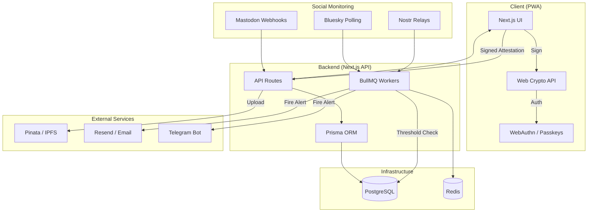

# Lifer

Lifer is a decentralized safety alert system designed for journalists, activists, and whistleblowers. It acts as a modern "warrant canary" or dead man's switch, linking social media activity to cryptographic safety attestations.

## Quick Start

### 1. Prerequisites
- Node.js 18+
- Docker & Docker Compose
- Redis (system-level or version 6.2+)

### 2. Setup environment
Copy the example environment file and fill in the secrets:
```bash
cp .env.example .env.local
```

### 3. Spin up infrastructure
Start the PostgreSQL and Redis services (this script checks for existing host services and only spins up Docker containers if needed):
```bash
npm run infra
```

### 4. Install dependencies & Migrate
```bash
npm install
npx prisma migrate dev
npx prisma generate
```

### 5. Run the application
Start the development server:
```bash
npm run dev
```
In a separate terminal, start the background workers:
```bash
npm run workers
```

## System Architecture



## Technical Stack
- **Frontend:** Next.js 14, Tailwind CSS (Glassmorphism), Shadcn UI.
- **Backend:** Next.js API Routes, Prisma ORM, PostgreSQL.
- **Background Jobs:** BullMQ, Redis.
- **Decentralization:** Web Crypto API (Ed25519), WebAuthn (Passkeys), IPFS (via Pinata).
- **Monitoring:** Nostr, Mastodon, Bluesky.

## Core Features
- **Two-Layer Check-ins:** Social post + Biometric signature.
- **Distress Signals:** Secret "Duress PIN" and "Distress Keypair" for silent alarms.
- **Automated Alerts:** Email and Telegram notifications when silence exceeds threshold.

## Documentation
- `README.md`: Project overview and setup.
- `TODO.md`: Remaining tasks and roadmap.
- `NEXT_STEPS.md`: History of implemented features and next execution steps.
- `copilot-instructions.md`: Detailed technical architectural guide.
