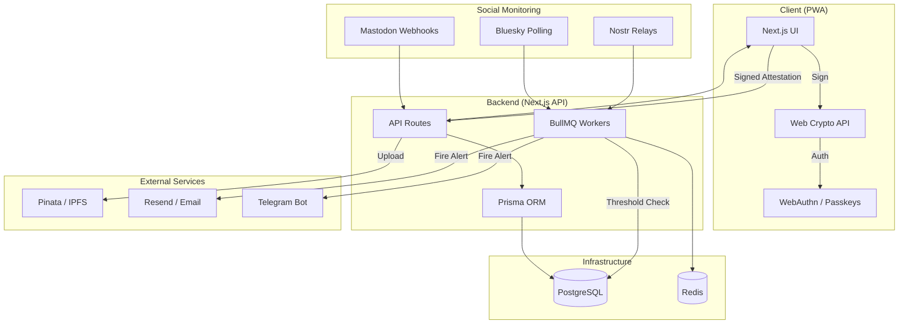

# Lifer

Lifer is a decentralized safety alert system designed for journalists, activists, and whistleblowers. It acts as a modern "warrant canary" or dead man's switch, linking social media activity to cryptographic safety attestations.

## Quick Start

### 1. Prerequisites
- Node.js 18+
- Docker & Docker Compose
- Redis (system-level or version 6.2+)

### 2. Setup environment
Copy the example environment file and fill in the secrets:
```bash
cp .env.example .env.local
```

### 3. Spin up infrastructure
Launch the full Lifer stack (Web Server, Workers, Database, and Redis) with a single command:
```bash
npm run infra
```
*Note: This script intelligently avoids port conflicts if you already have Postgres or Redis running on your host.*

### 4. External Database (e.g., Neon)
To use a cloud database instead of the local Docker one:
1. Update `DATABASE_URL` in `.env.local` with your connection string.
2. Run the migration to set up the schema:
   ```bash
   npx prisma migrate deploy
   ```
3. Run `npm run infra` as usual; it will automatically detect the external URL.

### 5. Running for Development
If you prefer to run the components locally while keeping just the DB in Docker:
1. **Infrastructure**: `npm run infra` (starts only missing services).
2. **Web Server**: `npm run dev` in one terminal.
3. **Workers**: `npm run workers` in a second terminal.
4. **Data Browser**: `npx prisma studio` in a third terminal.

## System Architecture



## Technical Stack
- **Frontend:** Next.js 14, Tailwind CSS (Glassmorphism), Shadcn UI.
- **Backend:** Next.js API Routes, Prisma ORM, PostgreSQL.
- **Background Jobs:** BullMQ, Redis.
- **Decentralization:** Web Crypto API (Ed25519), WebAuthn (Passkeys), IPFS (via Pinata).
- **Monitoring:** Nostr, Mastodon, Bluesky.

## Core Features
- **Two-Layer Check-ins:** Social post + Biometric signature.
- **Distress Signals:** Secret "Duress PIN" and "Distress Keypair" for silent alarms.
- **Automated Alerts:** Email and Telegram notifications when silence exceeds threshold.

## Documentation
- `README.md`: Project overview and setup.
- `TODO.md`: Remaining tasks and roadmap.
- `NEXT_STEPS.md`: History of implemented features and next execution steps.
- `copilot-instructions.md`: Detailed technical architectural guide.
